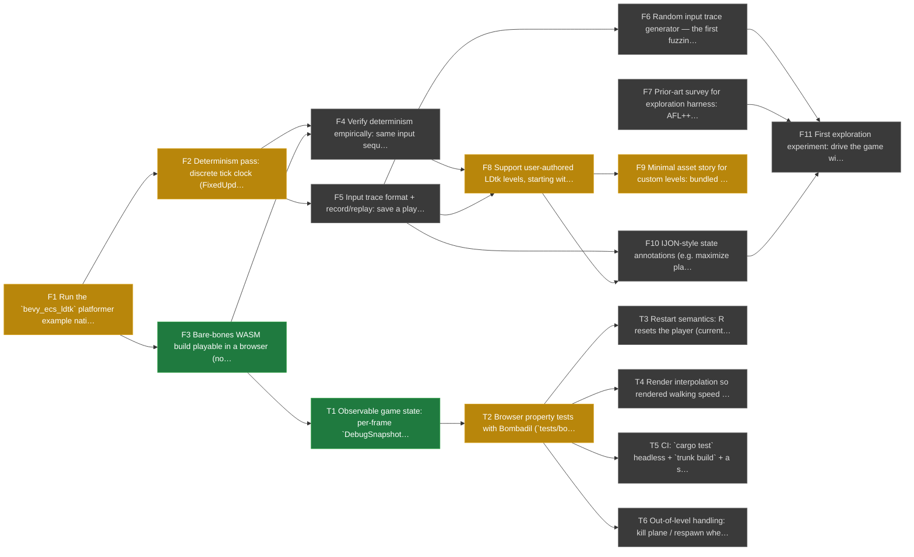

# flezzle-rs Roadmap

Deterministic, browser-playable platformer level player (eventually creator) with
first-class input-trace replay and fuzzing-style state-space exploration. Background
and sources: [ldtk-fuzzing-research-summary.md](ldtk-fuzzing-research-summary.md).

This file is a [task-dag](https://github.com/nverhaaren/task-dag) file — the tables
below are the canonical task store, and the diagram is generated from them.

<!-- task-dag:graph -->

<!-- /task-dag:graph -->

## Phase 1 — Deterministic playable core

| ID | Task | Depends on | Status |
|----|------|-----------|--------|
| F1 | Run the `bevy_ecs_ldtk` platformer example natively; pin Bevy / bevy_ecs_ldtk / Avian versions | — | `[~]` |
| F2 | Determinism pass: discrete tick clock (FixedUpdate, constant dt), explicit system ordering, no HashMap-iteration-order leaks, seeded RNG only | F1 | `[~]` |
| F3 | Bare-bones WASM build playable in a browser (no threads, no SIMD) | F1 | `[x]` |
| F4 | Verify determinism empirically: same input sequence → same trace, natively and in WASM; note any native-vs-WASM divergence | F2, F3 | `[ ]` |
| F5 | Input trace format + record/replay: save a play session as a trace file, replay it to an identical outcome | F2 | `[ ]` |
| F6 | Random input trace generator — the first fuzzing primitive | F5 | `[ ]` |
| F7 | Prior-art survey for exploration harness: AFL++/IJON, libafl, TAS tooling, public Antithesis-adjacent code; use with attribution where applicable | — | `[ ]` |

## Phase 2 — Custom levels

| ID | Task | Depends on | Status |
|----|------|-----------|--------|
| F8 | Support user-authored LDtk levels, starting with one simple example level; must preserve web play, determinism, and replay | F4, F5 | `[~]` |
| F9 | Minimal asset story for custom levels: bundled default tileset/sprites; user-supplied assets later | F8 | `[~]` |
| F10 | IJON-style state annotations (e.g. maximize player x) exposing ECS state to an exploration harness | F5, F8 | `[ ]` |
| F11 | First exploration experiment: drive the game with generated traces against an annotated level; evaluate existing tools (per F7) vs. new harness | F6, F7, F10 | `[ ]` |

## Testing

| ID | Task | Depends on | Status |
|----|------|-----------|--------|
| T1 | Observable game state: per-frame `DebugSnapshot` (native resource; `window.flezzle` + DOM JSON on the web) | F3 | `[x]` |
| T2 | Browser property tests with Bombadil (`tests/bombadil/`): boot, liveness, draw order, smooth walking, restart, chest push; per-level runner | T1 | `[~]` |
| T3 | Restart semantics: R resets the player (currently `Worldly` survives reloads); un-ignore `restart_key_resets_player_to_spawn` | T2 | `[ ]` |
| T4 | Render interpolation so rendered walking speed is smooth at any refresh rate (Avian interpolation + camera); make `smoothWalking` pass on real displays | T2 | `[ ]` |
| T5 | CI: `cargo test` headless + `trunk build` + a short Bombadil run per level | T2 | `[ ]` |
| T6 | Out-of-level handling: kill plane / respawn when the player leaves the level (found by Bombadil on a wall-less level); keep `playerStaysInLevel` honest | T2 | `[ ]` |

## Later (unscheduled)

Not yet tasks — direction notes, roughly in order of interest:

- Exploration harness maturation; possibly surfaced in web mode as "Auto-TAS".
- Game mechanics depth: enemies, gizmos, hazards.
- In-browser level editor (LDtk remains the editor until then, possibly for a long while).
- Public hosting; a shared repository of uploaded levels.
- Linking levels into worlds; large interconnected Metroidvania-style areas with tiered gates.
- Save states (natural given determinism) and a more formal "save file" for longer play.
- Other genres (Zelda-likes, Metroidvanias) and customizable character moves (e.g. Ori-style bash).

## Log
- 2026-09-07 22:20 F2: Scouting round 1: gameplay on FixedUpdate at 60 Hz, tick-sampled input (TickInput). Remaining: HashMap/ordering audit, seeded RNG, empirical verification (F4).
- 2026-09-07 22:20 F8: Scouting round 1: LevelSource + switching, user:// upload source, template + 3 generated starter levels, docs/making-levels.md. Remaining: kill plane, level-complete condition, Door semantics.
- 2026-09-07 22:20 F9: Scouting round 1: bundled SunnyLand + Caz atlases pre-seeded for uploads; custom tilesets not yet supported.
- 2026-09-07 22:24 F3: Static Trunk bundle (dist/): WebGL2, atlas tilemaps, level picker + .ldtk file upload. Verified in headless Chrome for Testing 152 (SwiftShader): 0 console errors, levels spawn, screenshot framed correctly. Build: trunk build --cargo-profile wasm-release (~3-5 min); 38 MB dist, 10 MB gzipped wasm.
- 2026-09-14 04:11 T1: DebugSnapshot: per-frame resource natively; window.flezzle + <script id=flezzle-state> JSON on the web. Verified readable by Bombadil extractors.
- 2026-09-14 04:11 T2: Round 2 (2026-09-13): boot/liveness/draw-order pass; smoothWalking and chestCanBePushed fail as intended (T4, tuning); Bombadil PressKey does not reach winit (code = key name), synthetic taps used; found wall-less template + inescapable pit.
